

> A curated collection of resources and exercises to help you learn about system design

* [Topics](#topics)
* [Topics Explained](#topics-explained)
* [Exercises](#exercises)
  * [General](#general)
  * [AWS Cloud](#aws-cloud)
  * [Misc](#misc-exercises)
* [Questions](#Questions)
* [Resources](#Resources)
* [System Design](#system-designs)
  * [Cloud](#system-design-cloud)
  * [Development](#system-design-development)
  * [Generic Systems](#system-design-generic-systems")
  * [Real-World Systems](#system-design-real-world-systems")
* [System Design Process](#system-design-process)
* [Interview Tips](#system-design-interview-tips)
* [Q&A](common-qa.md)
* [Credits](credits.md)

## System Design Concepts

* [Requirements](#requirements)
  * [Functional Requirements](#functional-requirements)
  * [Non-Functional Requirements](#non-functional-requirements)
* [Basic architecture](#basic-architecture)
  * [Client](#Client)
  * [Server](#Server)
  * Dispatcher
* [Scalability](#scalability)
  * [Vertical Scaling](#vertical-scaling)
  * [Horizontal Scaling](#horizontal-scaling)
  * [Scalability Factor](#scalability-factor)
    * [Linear Scalability](#linear-scalability)
    * [Sub-linear scalability](#sub-linear-scalability)
    * [supra-linear scalability](#supra-linear-scalability)
    * [Negative scalability](#negative-scalability)
* Availability
* Reliability
* Serviceability
* Performance
* Resiliency
* Durability
* [Failover](#failover)
  * [Cold Standby](#cold-standby)
* Microservices Architecture
* Monolith Architecture
* Cache
  * Distributed Cache
  * Cache Policy (aka Replacement Policy)
    * LRU (least recently used)
* [Load Balancer](#load-balancing)
  * Consistent Hashing
  * Techniques
    * Round Robin
    * Weighted Round Robin
    * Least Connection
    * Weighted Least Connection
    * Resource Based
    * Fixed Weighting
    * Weighted Response Time
    * Source IP Hash
    * URL Hash
  * Sticky Sessions
  * Health Checks
* Fault Tolerance
* [Distributed Systems](#distributed-systems)
  * [Fallacies of distributed systems](#fallacies-of-distributed-systems)
  * [Clock Drift](#clock-drift)
* Extensibility
* Loose Coupling
* Proxy
* Storage
  * RAID
* [CDN](#CDN)
* [DNS](#DNS)
    * Records
      * TTL
    * TLD and SLD
* [Networking](#networking)
  * Bandwidth
  * IP
    * [Private IP](#private-ip)
    * [Public IP](#public-ip)
  * Latency
  * Throughput
* Databases
  * Types
    * SQL
    * NoSQL
  * Sharding
  * Replication
    * Read Replicas
* Design Level
  * Low level design
  * High level design

## Concepts Explained

### Requirements

Usually a system design process starts with understanding the system's purpose and one way to understand system's purpose or goal, is to clearly define a list of requirements. 
These requirements allow us not only to understand how the system will be used and how it works, but also set clear boundaries which will make sure our design is focused on the right aspects of the system design. We usually distinguish between functional and non-functional requirements.

### Functional Requirements

Functional requirements are used to specify an expected function or a behaviour of the system. Simply put, something the system should be able to do. 
For example, for a video streaming service a requirement might be to upload a video or comment on a video. For instant messaging application, a functional requirement will be, to be able send and receive messages.

### Non-Functional Requirements

Non-functional requirements focus on how the system performs, especially in general and not focusing on specific functions. 
While such requirements might affect user's experience they shouldn't affect specific functionality or features the system supports.

For example, if a system is a type of a service, a non-functional requirement might be "zero downtime" or "No loss of data".

### Basic Architecture

#### Client

A client refers to a software or hardware accessing a resource or a service that is served by a server.
While in some cases the server and the client might be on the same system/host, in most cases they will be on separate systems.

Examples for clients:

* A Web browser that is used by a user to access a certain web page
* A mobile phone that is used by the user to read emails

#### Server

A server, similarly to a client, can be a software or hardware, but as opposed to a client, its role is to serve the client. It can be by providing a certain resource to the client or let it use a service that is running on the server.
Few examples:

* A system that stores files and allow the user to access or download them
* A system that runs a service which allows users to listen to music

### Scalability

[Wikipedia](https://en.wikipedia.org/wiki/Scalability): "Scalability is the property of a system to handle a growing amount of work by adding resources to the system"

In simpler words, scalability is about answering the question whether a system or an architecture are able to scale in a way that meets the new workloads and demand. 
More practically, answer questions like:
  * if a system runs a database, does it able to handle more queries?
  * if a system runs a service that streams videos to million of users. Will it able to stream them the same way if the amount of users would triple itself?

Also, scaling can be performed on different components. For example, in most cloud environments scaling is supported in case of:

  * Virtual Machines
  * Virtual network functions
  * Containers

There are different ways to scale.

#### Vertical Scaling

Vertical Scaling is about adding additional resources to *the existing system/component/unit*. If for example, we have a server, a vertical scaling might be done in one or more of the following ways:

  * Adding more RAM to the server
  * Adding more storage/disks
  * Adding CPUs

##### Use Cases

If you are looking for simple change, one that doesn't involves adding new components to your architecture and if your app/system has low traffic, then vertical scaling can be a great option

##### Limits

The limit of vertical scaling is clear - you are able to scale until your are no longer able to physically or virtually increase the resources of your machine.

#### Horizontal Scaling

Adding more systems/units/components but at the same time, make them work together so it would seems to the client as if there is one system it interacts with. 
Few examples:

 * Instead of one web server, having two web servers with one load balancer balancing the traffic between them
 * Instead of one database server, having two databases

Point to think about: now that you know about vertical scaling and horizontal scaling, which one would you perform if you can choose only one of them?

#### Scalability Factor

When you double the resources of your system (or design) you might expect your system to be able to handle double the workload as well, right? But this is not necessarily what will happen. Scalability factor is the term used to describe the workload your system is able to handle as a result of scaling your resources.

##### Linear Scalability

Linear Scalability happens when the workloads your system is able to handle scale accordingly to the scale in resources. The scalability factor remains constant as you scale. 
For example, you triple the resources of your system -> the system is able to handle triple the workloads. In reality, it's actually not the case most of the time.

##### Sub-Linear Scalability

A more realistic outcome of scaling systems would be that some resources or component may not scale as expected (or as other resources and components). So doubling the resources will actually lead to an improvement of only x1.5 in workloads handling. In this case the scalability factor will be lower than 1.0

##### Supra-Linear Scalability

This is the optimal outcome. You triple the workloads handling by "only" doubling your resources for example. In other words, the ratio in performance change is bigger than the ratio in scaling changes (e.g. adding more CPUs). A scalability factor in this case, is bigger than 1.0

##### Negative Scalability

It may sound crazy, but in some cases, scaling your system might actually lead to worse results and that's exactly what negative scalability is all about. Scalability factor is below 0.

### Failover

Failover (or failover strategy) is the process of switching upon a failure from non-operational system (application, storage, DB, ...) to an operational system or a previous operational state of the same system.

It used to be done either automatically or manually. Today, especially in the era of public clouds, this process is often automated.

#### Cold Standby

TODO

### Load Balancer

[Wikipedia](https://en.wikipedia.org/wiki/Load_balancing_(computing)): "In computing, load balancing refers to the process of distributing a set of tasks over a set of resources (computing units), with the aim of making their overall processing more efficient."

Load balancer is a very important component in system design. You might already seen it mentioned in other sections like "horizontal scaling", so you understand that it's a very common component in many system designs.

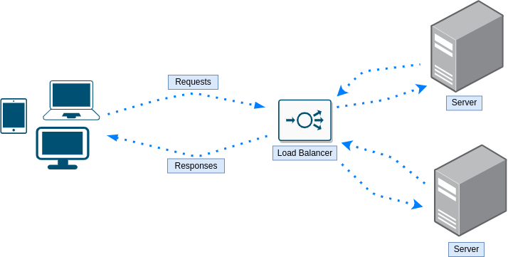

There a couple of things to remember about load balancers:

  * Usually the IP address of the load balancer itself is public while the addresses of the instances/servers are private (there is no reason to allow users/clients to reach them directly and bypass the load balancer)
  * There are multiple techniques/algorithms as to how to perform the load balancing itself

### Availability

[Wikipedia](https://en.wikipedia.org/wiki/Reliability,_availability_and_serviceability): "Availability means the probability that a system is operational at a given time, i.e. the amount of time a device is actually operating as the percentage of total time it should be operating. High-availability systems may report availability in terms of minutes or hours of downtime per year."

In simpler words, the percentage of time a system, service or app is accessible, operational

### Reliability

[Wikipedia](https://en.wikipedia.org/wiki/Reliability,_availability_and_serviceability): "Reliability can be defined as the probability that a system will produce correct outputs up to some given time t.[5] Reliability is enhanced by features that help to avoid, detect and repair hardware faults. A reliable system does not silently continue and deliver results that include uncorrected corrupted data."

Question: can you explain the difference between Availability and Reliability?

### Serviceability

[Wikipedia](https://en.wikipedia.org/wiki/Reliability,_availability_and_serviceability): "Serviceability or maintainability is the simplicity and speed with which a system can be repaired or maintained; if the time to repair a failed system increases, then availability will decrease."

### Networking

#### Public IP

[Wikipedia](): "A public IP address, in common parlance, is a globally routable unicast IP address, meaning that the address is not an address reserved for use in private networks"

From system design perspective, when you have a resources or a component, you would like everyone to be able to access to, whether for direct communication (like a web server) or as a gateway for other components (like a load balancer), you should use a public IP

#### Private IP

Whenever you DON'T want users to be able to globally interact with a certain component or resource, you should use a private IP address. Few examples:

  * Web servers that only the load balancer should communicate with them directly and not the users/clients themselves
  * Internal servers that users outside the organization shouldn't access

Private IPs, as opposed to public IPs, don't have to be unique and each separate network, can use the same addresses (because it's private :) )

#### Latency

The time it takes to perform a certain task/action

#### Throughput

The number of tasks/actions per unit of time

### Databases

[Wikipedia](https://en.wikipedia.org/wiki/Database): "a database is an organized collection of data stored and accessed electronically from a computer system."

Perhaps the most basic example for a database would be a file on filesystem. This file can store information on people and their addresses, it can contain information on types of wine, or any other organized data.

Even though a file can be considered a database, you'll not find it used in system designs. Databases today are full and rich services that supports much more than just storing your data.

#### Types

##### SQL

##### NoSQL

#### Replication

[Wikipedia](https://en.wikipedia.org/wiki/Replication_(computing)): "Replication in computing involves sharing information so as to ensure consistency between redundant resources, such as software or hardware components, to improve reliability, fault-tolerance, or accessibility."

You'll see in many system designs that it's quite common to have separate instance for writes and another instance for reads. Thing is, when you split it into read and write instances, you have to make sure the data is consistent. This is where replication becomes relevant.

### DNS

[Wikipedia](https://en.wikipedia.org/wiki/Domain_Name_System): "Most prominently, it translates more readily memorized domain names to the numerical IP addresses needed for locating and identifying computer services and devices with the underlying network protocols."

In other words, the most common use can of a DNS would be a address translation. It can be from a hostname to IP address and vice versa - from an IP address to a hostname.
In addition, a DNS can be used for load balancing, using the round robin technique.

### Distributed Systems

#### What is a distributed system?

* A group of computers/servers working together
* The complexity of distributed system often hidden from the user

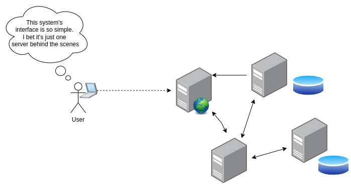

#### Fallacies of distributed systems

There are some challenges that we have to deal with when designing and managing distributed/high-scale systems, but not so much with non-distributed systems:

* Network Reliability: when you run a system on a single host, networking isn't as problem as when you need to to manage dozen or hundreds (and more) nodes
* Zero Latency: running on a single host, latency is not an issue, but when managing multiple hosts, how to keep latency as close as possible to zero?
* Bandwidth: same a latency, when running on a single host, bandwidth is infinite, but when the system is distributed you have to move data between the server so bandwidth becomes a challenge 
* Constantly changing Topology: In distributed system, hosts and different components may go down or up meaning, the topology is constantly changing while a single host is a constant
* Security: keeping one host secured is much more simple than securing a distributed system where not only all components should be secured but also the communication between the different hosts and components
* Size of the team: managing one host requires less administrators than managing a distributed system with hundreds, thousands or even more hosts and components

### Clock Drift

[Wikipedia](https://en.wikipedia.org/wiki/Clock_drift): "Clock drift refers to several related phenomena where a clock does not run at exactly the same rate as a reference clock. That is, after some time the clock "drifts apart" or gradually desynchronizes from the other clock"

Synchronizing clock is a challenge in distributed systems because each system has its own clock and once the system's clock drifts, this might affect the system as a whole and lead to unintended behaviours.

### CDN

[Cloudflare](https://www.cloudflare.com/en-gb/learning/cdn/what-is-a-cdn): "A content delivery network (CDN) refers to a geographically distributed group of servers which work together to provide fast delivery of Internet content."

In other words, a content delivery network allows you to quickly transfer content by having servers with the content around the world or certain area. The client then, access these servers instead of the main server where the data originates from.

## Exercises
### General

#### "Elementary, my dear Watson"

The following is an architecture of a server which runs a web server and a database on it. There are a dozen of clients connecting to the server. Answer the following questions

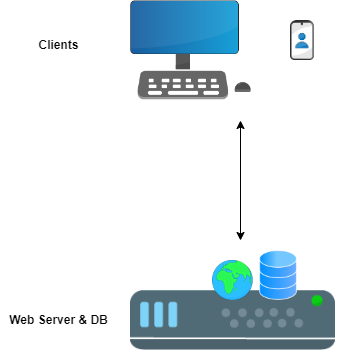

1. Name two issues with this architecture
   - What term/concept in system design used to describe one of the issues you specified?
2. Suggest an improvement to the architecture **WITHOUT** adding more components
   1. If the suggested improvement is "vertical scaling", is it a permanent improvement?
3. Suggest two improvements to the architecture, given that additional components can be added

 <b>

1. Two issues:
   1. Single point of failure - if the server is down, the users would not be able to connect the application and the server will have to be restored or created from scratch
   2. If the web process is using all the RAM and/or CPU, then it might affect the DB since it won't have enough resource to handle requests. This is true also the opposite way of DB consuming all resources, not leaving enough for web server processes.
      - The term used to describe the issue it "scalability". The server doesn't scale by demand and eventually users will experience issues

2. Apply [vertical scaling](#vertical-scaling). By adding more resources to the server (i.e. CPU & RAM) it will allow it to handle more load. This is nota  permanent solution because at some point the load might scale to a point where it's not possible to add more RAM and CPU to the instance nor it's really worthwhile.

3. The two improvements would be:
   1. Separate DB and web server into two components (instead of both running on the same instance)
   2. Apply [horizontal scaling](#horizontal-scaling) - add more web server servers (it's also possible to add more DB instances)

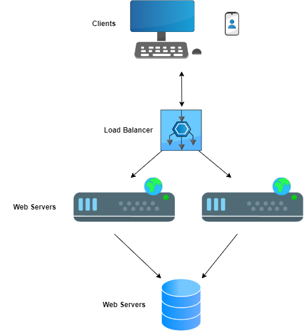

</b>

### AWS Cloud

#### What time is it? (stateless application)

Design the most basic architecture for a web application (server based) that tells a single user what time is it (no DB, no scaling, ...) with maximum of two components

 <b>

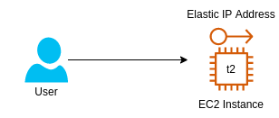

In this case what you need is two components:

* EC2 instance - this is where our application will run. A basic micro t2 instance is more than enough
* Elastic IP address - This is the static IP address our user will use every time to reach the application. In case the instance is not operational, we could always move the IP address to one that it is (if we manage more than one instance)
</b>

Your web app became a huge success and many users start using it. What might be the problem with moving from one user to multiple users and how to deal with it using a single improvement of the architecture?

 <b>

Your instance might not be strong enough to handle requests from multiple users and soon enough you might see RAM and CPU utilized fully. One way to deal with it is, to perform what is called "Vertical Scaling" which is the act of adding more resources to your instance. In AWS case, switching to an instance type with more resources like M5 for example.

Note: The problem with vertical scaling (in case you have one node) is downtime (when upgrading the instance type, the instance will be down) so another thing you would want to do is "Horizontal Scaling" which is the act of adding more instances/resources.

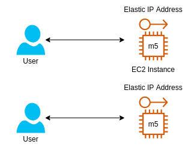

</b>

You would like to change the architecture offered in the solution, to not use elastic IP addresses for obvious reasons that it's not really scalable (each EC2 instance has a different IP and users are not able to remember them all). Offer an improvement

 <b>

Instead of using elastic IP addresses we can add a record in the DNS, using the Route 53 service, to have a record from the type A. This way, all users will be able to access the app using an hostname and the IP address will be provided to them by the DNS

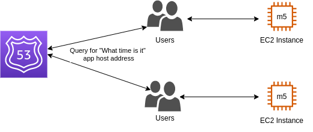

It's important to note that this solution is not optimal if you plan to scale down and up at some point. Due to the TTL value of a record, a user will keep contacting the same IP address, even if the node is already down.

A more proper and complete architecture would be to use an ELB

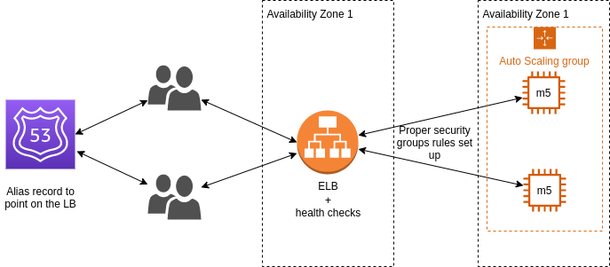

But even with ELB used and "Auto scaling group" for automatically scaling the nodes, this architecture is not optimal. Can you point what is the problem with current architecture? (from two different aspecs)
</b>

State the issues with current architecture and what would you imrpove

 <b>

With current architecture, the application is perhaps able to scale up and down, but when the availability zone is down, your entire application is down. So the first improvement would be to make both ELB and the application itself (the EC2 instances) multi-AZ.

Secondly, if you know you always need an instance (or two) for the application, you might want to have reserved nodes. Reserved nodes means you pay less for instances which means you save on costs.

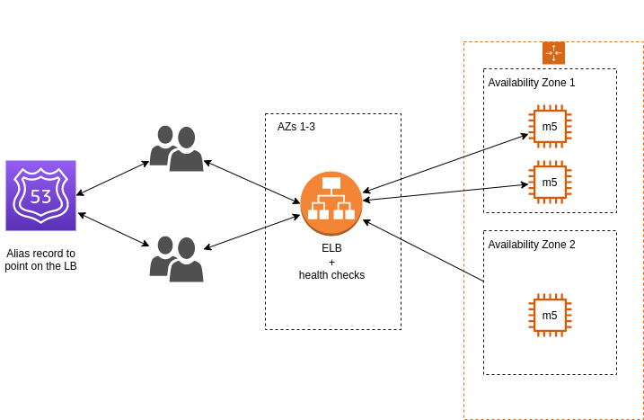

</b>

#### "Video Games Shop" (stateful application)

The following architecture was proposed for an online video games shop with the requirements of:

  * Support thousands of users at any given point of time
  * Users can register
  * Shopping cart items shouldn't be lost when the user browsing the store

The problem is that users report that when they browse for additional video games to buy, they lose their shopping cart. What is the problem with the current architecture and how to deal with it?

 <b>

Such application is a stateful application, meaning it's important that we'll keep the information about the client from one session to another. It seems that with current architecture, every time the user initiates new session, it's perform against a different instance without saving client information.

There are a couple of solutions that can be applied in this case:
  * Load Balancer Sticky Sessions: users will be redirected to the instance they initiated previously session with, in order to to not lose client's data. There is a disadvantage here of losing
  * User cookies: the client/user stores the relevant data (shopping cart in this case) and in this case it doesn't matter with which EC2 instance the user interacts with, the data on the shopping cart will be sent from the client/user to the relevant instance. The disadvantages: HTTP requests are much heavier because data is attached with each request and it holds some security risks as cookies can be potentially modified
</b>

#### "Video Games Shop"

Following the last exercise, is there another way to deal with user's data (short and long term) except user's cookies and sticky sessions?

 <b>

There is something called "server session" where we need to add a new component to the architecture - ElastiCache or DynamoDB, to store the data on the shopping cart of each user. In order to identify it, we'll use a session ID which will be sent by the client/user every request

For long term data (user name, address, etc.) we'll use a database (e.g. RDS). There are a couple of variations as to how we can use it. A master instance where we'll write the data and a replication from which we'll read data:

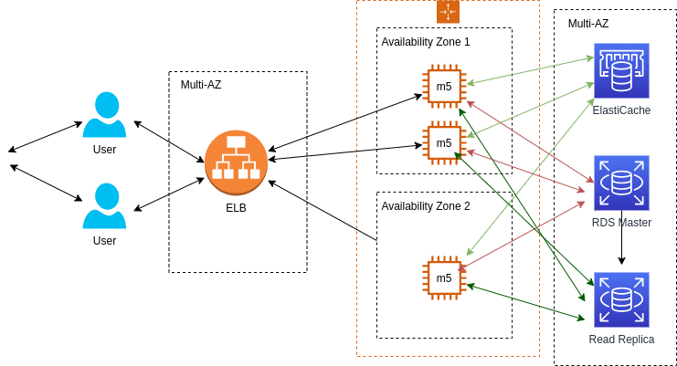

A different approach can be to use Cache + DB, where for each session, we'll check if the data is in the cache and if it's not, then we'll access the DB (this is also called "Write Through"): 

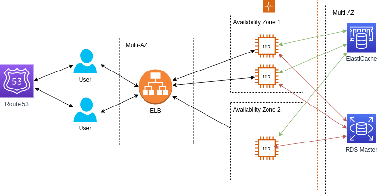

</b>

### Misc

Note: Exercises may repeat themselves in different variations to practice and emphasize different concepts.

#### "Perfectly balanced, as all things should be"

You have the following simple architecture of a server handling requests from a client. What are the drawbacks of this design and how to improve it?

 <b>

* Limitations:
  * Load - at some point it's possible the server will not be able to handle more requests and it will fail or cause delays
  * Single point of failure - if the server goes down, nothing will be able to handle the requests

* How to improve: 
  

  
  

* Further limitations:
    * Load was handled as well as the server being a single point of failure, but now the load balancer is a single point of failure.
</b>

Is there a way to improve the above design without adding an actual load balancer instance?
 <b>

Yes, one could use DNS load balancing. 
Bonus question: which algorithm a DNS load balancer will use?
</b>

What are the drawbacks of round robin algorithm in load balancing?
 <b>

  * A simple round robin algorithm knows nothing about the load and the spec of each server it forwards the requests to. It is possible, that multiple heavy workloads requests will get to the same server while other servers will got only lightweight requests which will result in one server doing most of the work, maybe even crashing at some point because it unable to handle all the heavy workloads requests by its own.
  * Each request from the client creates a whole new session. This might be a problem for certain scenarios where you would like to perform multiple operations where the server has to know about the result of operation so basically, being sort of aware of the history it has with the client. In round robin, first request might hit server X, while second request might hit server Y and ask to continue processing the data that was processed on server X already.
</b>

#### "For all my actions both public and private"

The following is an architecture of a load balancer serving and three web servers. Assuming, we would like to have a secured architecture, that makes sense, where would you set a public IP and where would you set a private IP? 

 <b>

It makes sense to hide the web servers behind the load balancers instead of giving users direct access to them, so each one of them will have a private IP assigned to it.
The load balancer should have a public IP since, we except anyone who would like to access a certain web page/resource, to go through the load balancer hence, it should be accessible to users.
</b>

What load balancing techniques are there?
 <b>

  * Round Robin
  * Weighted Round Robin
  * Least Connection
  * Weighted Least Connection
  * Resource Based
  * Fixed Weighting
  * Weighted Response Time
  * Source IP Hash
  * URL Hash
</b>

#### "Keep calm, all I want is your cash"

The following is a simple architecture of a client making requests to web server which in turn, retrieves the data from a datastore. What are the drawbacks of this design and how to improve it?

 <b>

* Limitations:
  * Time - retrieving the data from the datastore every time a request is made from the client, might take a while
  * Single point of failure - if the datastore is down (or even slow) it wouldn't be possible to handle the requests
  * Load - the datastore getting all the requests can result in high load on the datastore which might result in a downtime

* How to improve: 
  

  
  

</b>

Are you able to explain what is Cache and in what cases you would use it?
 <b>

Why to use cache?

  * Save time - Accessing a remote datastore, and in general making network calls, takes time
  * Reduce load - Instead of the datastore handling all the requests, we can take some of its load and reduce by accessing the cache
  * Avoid repetitive tasks - Instead of querying the data and processing it every time, do it once and store the result in the cache
</b>

Why not storing everything in the cache?
 <b>

For multiple reasons:

1. The hardware on which we store the cache is in some cases much more expensive
2. More data in the cache, the bigger it gets and longer the put/get actions will take
</b>

#### "In a galaxy far, far away..."

The following is a system design of a remote database and three applications servers

 <b>

* Limitations:
  * Latency. Every query made to the remote database will hit latency, even if small.
  * In case the remote database crashes, the app will stop working

* How to improve: 
  

  
  

  * Replicate each database to the local app server. This has several advantages. First, we are not bound to latency anymore. Secondly, a fai

* Further limitations:
  * We are bound now to bandwidth
  * If the remote database isn't accessible for a long period of time, we'll have an outdated database and each app has the potential to work against a different DB
</b>

#### "A bit on the slow side"

The following is an improvement of the previous system design

 <b>

* Limitations:
  * Queries to database might be slow, even on the server itself where the app is running
  * Once the remote database isn't available, the local databases will not by in sync

* How to improve: 
  
</b>

#### "Always the same one"

Every request sent by the same client, is routed every time to a different web server. What problem the user might face with such design? How to fix it?

 <b>

* The problem: the user might need to authenticate every single request, because different web servers handle its requests.
* A possible solution: use sticky sessions where the user is routed to the same instance every single time

</b>

#### "Coming back to find we've failed"

You have a design of load balancer and a couple of web instances behind it. Sometimes the instances crash and the user report the application doesn't works for them. Name one possible way to deal with such situation.
 <b>

One possible way to deal with it, is by using health checks. Where an instance that doesn't pass the health check, will be excluded from the list of instances used by the load balancer to forward traffic to.

</b>

#### "In any major city, minding your own business is a science"

You have a production application using a database for reads and writes. Your organization would like to add another application to work against the same database but for analytics purposes (read only). What problem might arise from this new situation and what one improvement you can apply to the design?

 <b>

Adding another application to work against the same database can create additional load on your database which may lead to issues since the additional load might reach the limits of your database capacity constraints.

One improvement to the design could be to add a read replica instance of your database. This way the new application can work against the read replica instead of the original database. The replication will be asynchronous but in most cases, for analytics applications, that's good enough.

</b>

## Questions

This is a more "simplified" version of exercises section. No drawings, no evolving exercises, no strange exercises names, just straightforward questions, each in its own category.

Your website usually serves on average a dozen of users and has good CPU and RAM utilization. It suddenly becomes very popular and many users try to access your web server but they are experiencing issues, and CPU, RAM utilization seems to be on 100%. How would you describe the issue?
 <b>

Scalability issue. The web server doesn't scales :'( 
In order to avoid such issues, the web server has to scale based on the usage. More users -> More CPU, RAM utilization -> Add more resources (= scale up). An
When there are less users accessing the website, scale down.
</b>

### Scalability

Explain Scalability
 <b>
</b>

Explain "Vertical Scaling" and give an example where it can help to solve an issue
 <b>

Vertical scaling is the act of adding

For example, you have a website which serve a class of 20 students. Suddenly, you are teaching multiple classes and your website has to service 40 students. In order to be able to do that, you might have to apply "vertical scaling" and add resources like RAM and CPU to the server running your website.
</b>

Why we can't usually rely solely on "vertical scaling" to solve scaling issues?
 <b>

Because you can't keep upgrading forever a certain server. At some point, you'll hit limitations of buying the best components you could and not having additional space for more components. Maybe the best RAM you could buy is 10TB, but you actually need 19TB RAM to serve all the users.
</b>

What is "Horizontal Scaling"?
 <b>
</b>

If you can only choose to perform horizontal scaling or vertical scaling, but not both, which one would you perform?
 <b>
</b>

Once we perform "Horizonal Scaling", by for example adding multiple web servers instead of having one server, how do we handle client access to these servers? 
 <b>

Using a load balancer
</b>

Name one disadvantage and one advantage of vertical scaling over horizontal scaling
 <b>

Advantage: Simplicity. You increase the resources (maybe also restart something) but that's it, there is no architectural change. In horizontal scaling, you usually need to add a load balancer to distribute the traffic or access to the different nodes, which is considered an architectural change.

Disadvantage: Redundancy. When performed solely on a single server, your architecture will still suffer from redundancy - when your single server is down, your entire application is down.
</b>

### Load Balancer

Why do we need load balancers?
 <b>
</b>

What load balancing techniques are there?
 <b>

  * Round Robin
  * Weighted Round Robin
  * Least Connection
  * Weighted Least Connection
  * Resource Based
  * Fixed Weighting
  * Weighted Response Time
  * Source IP Hash
  * URL Hash
</b>

True or False? Usually, in basic architectures, the servers behind a load balancer are using private IPs while the load balancer itself is using a public IP
 <b>

True. This serves two purposes:

  * We want everyone to use the load balancer :)
  * It provides a better security, by not allowing everyone to reach the servers directly. This way, we can secure better one component rather taking care of the security of all the instances/servers behind the load balancer
</b>

Do you necessarily need a dedicated load balancer instance to perform load balancing? (using the round robin technique for example)
 <b>

No, you can use a DNS server.
</b>

What is an application load balancer?
 <b>
</b>

At what layers a load balancer can operate?
 <b>
</b>

What is DNS load balancing?
 <b>
</b>

What are the drawbacks of round robin algorithm in load balancing?
 <b>

  * A simple round robin algorithm knows nothing about the load and the spec of each server it forwards the requests to. It is possible, that multiple heavy workloads requests will get to the same server while other servers will got only lightweight requests which will result in one server doing most of the work, maybe even crashing at some point because it unable to handle all the heavy workloads requests by its own.
  * Each request from the client creates a whole new session. This might be a problem for certain scenarios where you would like to perform multiple operations where the server has to know about the result of operation so basically, being sort of aware of the history it has with the client. In round robin, first request might hit server X, while second request might hit server Y and ask to continue processing the data that was processed on server X already.
</b>

What are sticky sessions? What are their pros and cons?
 <b>
</b>

Explain each of the following load balancing techniques

  * Round Robin
  * Weighted Round Robin
  * Least Connection
  * Weighted Least Connection
  * Resource Based
  * Fixed Weighting
  * Weighted Response Time
  * Source IP Hash
  * URL Hash

 <b>
</b>

Which load balancing technique would you use for e-commerce website? Why?
 <b>

One that supports sticky sessions so users returning to the website, would have their data loaded, in case the server don't use shared storage.
</b>

### Failover

Explain what is a "Failover". What does it happen?
 <b>
</b>

Explain "Cold Standby" failover strategy
 <b>
</b>

### Cache

Tell me everything you know about Cache
 <b>
</b>

True or False? While caching can reduce load time, it's increasing the load on the server
 <b>

False. If your server doesn't have to execute the request since the result is already in the cache, then it's actually the opposite - there is less load on the server in addition to reduced load times.
</b>

### Networking

What is a public IP? In which scenarios, one should use a public IP?
 <b>
</b>

What is a private IP? In which scenarios, one should use a private IP?
 <b>
</b>

What is latency?
 <b>
</b>

What is latency of L1 cache reference vs. L2 cache reference?
 <b>

L1 cache reference latency is 0.5 nanosecond
L2 cache reference latency is 7 nanosecond

So basically the latency of L2 cache reference is 14x L1 cache reference.
</b>

### DNS

What is a DNS?
 <b>
</b>

Can you use DNS for load balancing?
 <b>
</b>

### Storage

What is RAID?
 <b>
</b>

### DNS

What is CDN?
 <b>
</b>

### Databases

What are the advantages of replicating a database?
 <b>

* Introducing high-availability: when creating a replication, you actually create another source of data you can use, even when your original instance is down
* Performances are better spread: you can decide that one of the instances is for reads while the other one is for reads
* Your app becomes more reliable: even if your database is down, the replication can still be used
</b>

### Misc

How operating systems able to run tasks simultaneously? for example, open a web browser while starting a game
 <b>

The CPU have multiple cores. Each task is executed by a different core. 
Also, it might only appear to run simultaneously. If every process is getting CPU allocation every nanosecond, the user might think that both processes are running simultaneously.
</b>

What is a VPS?
 <b>

[From wikipedia](https://en.wikipedia.org/wiki/Virtual_private_server): "A virtual private server (VPS) is a virtual machine sold as a service by an Internet hosting service."
</b>

True or False? VPS is basically a shared server where each user is allocated with a portion of the server OS
 <b>

False. You get a private VM that no one else can or should use.
</b>

### Distributed Systems

What are some of the challenges one has to face when designing and managing distributed systems, but not so much when dealing with systems/services running on a single host?
 <b>

See [Distributed Systems - Fallacies of distributed systems](#fallacies-of-distributed-systems)
</b>

What is a clock drift in regards to distributed systems?
 <b>

See [Distributed System - Clock Drift](#clock-drift)
</b>

## Resources

There many great resources out there to learn about system design in different ways - videos, blogs, etc. I've gathered some of them here for you

### By Topic

  
System Design Introduction

#### Articles
* [Introduction To Systems Design - 2020](https://medium.com/swlh/introduction-to-systems-design-9bdab73fb8)

  
Scalability

#### Videos
* [Harvard Scalability Lecture - 2012](https://www.youtube.com/watch?v=-W9F__D3oY4&ab_channel=JorgeScott)

#### Repositories
* [awesome-scalability](https://github.com/binhnguyennus/awesome-scalability) - "An updated and organized reading list for illustrating the patterns of scalable, reliable, and performant large-scale systems"

### By Resources Type

  
Videos

#### System Design
* [Gaurav Sen](https://www.youtube.com/watch?v=xpDnVSmNFX0&list=PLMCXHnjXnTnvo6alSjVkgxV-VH6EPyvoX) - Excellent series of videos on system design topics
* [System Design Interview](https://www.youtube.com/channel/UC9vLsnF6QPYuH51njmIooCQ) - How to get through system design interviews. Covering both architecture and code
#### Scalability
* [Harvard Scalability Lecture - 2012](https://www.youtube.com/watch?v=-W9F__D3oY4&ab_channel=JorgeScott)

  
Repositories

#### Scalability
* [awesome-scalability](https://github.com/binhnguyennus/awesome-scalability) - "An updated and organized reading list for illustrating the patterns of scalable, reliable, and performant large-scale systems"
#### System Design
* [system-design-primer](https://github.com/donnemartin/system-design-primer) - "Learn how to design large-scale systems. Prep for the system design interview."

  
Books

  
Articles

#### Introduction
* [Introduction To Systems Design - 2020](https://medium.com/swlh/introduction-to-systems-design-9bdab73fb8)

## System Designs

### General Systems

### System Design - Development

This section focusing on the development aspect of system design (e.g. Version Control, Development Environment, etc.).
Note: it might overlap with other sections such 'Cloud System Design'.

For each scenario try to identify the following:

  * Problem Statement & Analysis
  * Solution(s)

#### Big-Scale Monorepo

You are part of a team which owns a Git monorepo. Recently this monorepo grown quite a lot and now includes hundred thousands of files. Recently, developers in your team complain it takes a lot of time to run some Git commands, especially those related to filesystem state (e.g. `git status` takes a couple of seconds or even minutes). What would you suggest the team to do?

##### Big-Scale Monorepo - Problem Statement & Analysis

Let's start with stating the facts:
  * The repo has grown to include million of files
  * It takes seconds or minutes to run Git operations while usually it takes approximately 1-2 seconds at most

Next, it would be good to understand how exactly these different commands work in order to understand what we can do about the problem.
In case of `git status`, it runs diffs on HEAD and the index and also the index and `working directory`, to understand what is being tracked and what's not. This results in running lstat() system call which returns a struct on each file (including information like device ID, permissions, inode number, timestamp info, etc.). Running this on hundred thousands of files takes time, which explains why `git status` takes seconds, if not minutes, to run.

##### Big-Scale Monorepo - Solution(s)

The solution should be focusing on how Git can perform less work in regards to its operations. In this case it's very technology specific, but there is always something to learn, even in specific implementations, on the general design approach.

1. Use the built-in `fsmonitor` (filesystem monitor) of Git. With fsmonitor (which integrated with Watchman), Git spawn a daemon that will watch for any changes continuously in the working directory of your repository and will cache them . This way, when you run `git status` instead of scanning the working directory, you are using a cached state of your index.

2. Enable `feature.manyFile` with `git config feature.manyFiles true`. This does two things:

  1. Sets `index.version = 4` which enables path-prefix compression in the index
  2. Sets `core.untrackedCache=true` which by default is set to `keep`. The untracked cache is quite important concept. What it does is to record the mtime of all the files and directories in the working directory. This way, when time comes to iterate over all the files and directories, it can skip those whom mtime wasn't updated.

Before enabling it, you might want to run `git update-index --test-untracked-cache` to test it out and make sure mtime operational on your system.

3. Git also has the built-in `git-maintainence` command which optimizes Git repository so it's faster to run commands like `git add` or `git fatch` and also, the git repository takes less disk space. It's recommended to run this command periodically (e.g. each day).

4. Track only what is used/modified by developers - some repositories may include generated files that are required for the project to run properly (or support certain accessibility options), but not actually being modified by any way by the developers. In that case, tracking them is futile.
In order to avoid populating those file in the working directory, one can use the `sparse checkout` feature of Git.

5. Finally, with certain build systems, you can know which files are being used/relevant exactly based on the component of the project that the developer is focusing on. This, together with the `sparse checkout` can lead to a situation where only a small subset of the files are being populated in the working directory. Making commands like `git add`, `git status`, etc. really quick

### System Design - Generic Systems

This section covers system designs of different types of applications. Nothing too specific, but yet quite common in the real world as a type of application.

For each type of application we are going to mention its:

  * Requirements
  * API endpoints (public and internal)

#### Payment and Reservation System for Parking Garages

Design a payment and reservation system for parking garages that supports three type of vehicles:

  * regular
  * large
  * compact

With flat rate based on vehicle type and time

Note: if you've been told to design this type of system without any other requirements, the rate and special parking, is something you should ask about.

##### Payment and Reservation System for Parking Garages - Clarifications

Ask clarifying questions such as:

  * Who are the users and how they are going to use the system?
  * What inputs and outputs should the system support?
  * How much data do we expect the system to handle?
    * How many requests per second?

##### Payment and Reservation System for Parking Garages - Requirements

* User to be able to reserve a parking spot and receive a ticket
* User can't reserve a parking spot reserved by someone else
* System to support the following types of vehicles: regular, large and compact
* System to support flat rate based on vehicle type and time the vehicle spent in the parking

##### Payment and Reservation System for Parking Garages - API (Public Endpoints)

* `/reserve`
  * Parameters: garage_id, start_time, end_time
  * Returns: (spot_id, reservation_id)

* `/cancel`
  * Parameters: reservation_id

* `/payment`
  * Parameters: reservation_id
  * Use existing API like Squre, PayPal, Stripe, etc.

##### Payment and Reservation System for Parking Garages - API (Internal Endpoints)

* `/calculate_payment` - calculate the payment for reserving a parking spot
  * Parameters: reservation_id

* `/free_spots` - get free spots where the car can park (note: small car might be able to park in bigger car spot)
  * Parameters: garage_id, vehicle_type, time

* `/allocate_spot` - do the actual reservation of a parking spot
  * Parameters: garage_id, vehicle_type, time

* `/create_account` - the ability to create an account so users can use the app and reserve parking spots
  * Parameters: email, username, first_name (optional), last_name (optional), password (optional)

* `/login`
  * Parameters: email, username (optional), password

##### Payment and Reservation System for Parking Garages - Scale

We can assume that the number of users is limited to the number of parking spots in each garage and taking into account the number of garages of course. 
Given that, users scale is pretty predictable and can't reach unexpected count (assuming no new garages can be added or fixed rate of new garages being added)

##### Payment and Reservation System for Parking Garages - Data Scheme

SQL based database with the following tables

Reservations

| Field       | Type                |
| ----------- | --------------------|
| id          | primary key, serial |
| start       | timestamp           |
| end         | timestamp           |
| paid        | boolean             |

Garages

| Field        | Type                |
| ------------ | --------------------|
| id           | primary key, serial |
| zipcode      | varchar             |
| rate_compact | decimal             |
| rate_compact | decimal             |
| rate_regular | decimal             |
| rate_large   | decimal             |

Spots

| Field        | Type                |
| ------------ | --------------------|
| id           | primary key, serial |
| garage_id    | foreign_key, int    |
| vehicle_type | enum                |
| status       | enum                |

Users

| Field        | Type                |
| ------------ | --------------------|
| id           | primary key, serial |
| email        | varchar (SHA-256)   |
| first_name   | varchar             |
| last_name    | varchar             |

Vehicles

| Field        | Type                |
| ------------ | --------------------|
| id           | primary key, serial |
| license      | varchar             |
| type         | enum                |

##### Payment and Reservation System for Parking Garages - High-level architecture

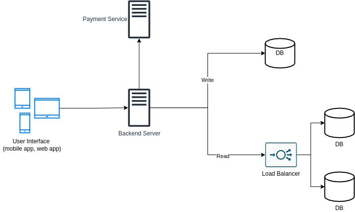

### System Design - Real-World Systems

This section covers system designs of real world applications.

Each section here will include full details on the system. It's recommended, as part of your learning process, that you will NOT look at these full details and start by trying figuring them out by yourself. More specifically, for every system:

  * Create a list of its functional requirements, features
  * Create a list of its non functional requirements
  * Design API spec
  * Perform high-level design
  * Perform detailed design

#### WhatsApp

##### WhatsApp - Features / Functional Requirements

  * Messaging with individuals and groups (send and receive)
  * Sharing documents, images, videos
  * User status - online, last seen, etc.
  * Message status - delivered, read (and who read it)
  * Encryption - encrypt end-to-end communication

##### WhatsApp - Non Functional Requirements

  * Scale
  * Minimal Latency
  * High Availability
  * Consistency
  * Durability

##### WhatsApp - API Spec

Messaging:

  * Direct Chat Session
    * Input: API key, user ID, user ID (recipient)
  * Send Message
    * Input: API key, session ID, message type, message

User account:

  * Register account
    * Input: API key, user data
  * Validate account
    * Input: API key, user ID, validation code

##### WhatsApp - System Design Overview

##### Whatsapp - System Design Components

## System Design Process

How to perform system design?
TODO(abregman): this section is not yet ready

1. Define clearly the requirements - if requirements are not clear, make sure to clarify them
2. Answer the question what is the projected traffic?
3. Define which quality attributes are important for your system - scalability, efficiency, reliability, etc.
4. TODO

## System Design Interview Tips

If you are here because you have a system design interview, here are a couple of suggestions:

* Choose the simplest architecture that captures the requirements (functional requirements but also expected traffic for example) of the system. No need to complicate things :)

More specific suggestions based on the phase of the interview:

### What to ask yourself when you see a system design

Note: You might want to ask yourself these questions also after you've done performing a system design

* Does it scale if I add more users?
* Is there a single point of failure in the design?
* Don't be shy about asking for clarifications on a given system design. Some system design are vague on purpose

### What to ask the interviewer

* What are the requirements?
  * How the system is used?
  * How much users are expected to access the system?
  * How often the users access the system?
  * Where the users access the system from?
* Are there any constraints?
* Ask for clarifications if needed. Sometimes instructions or requirements are vague on purpose.

#### What to say at the beginning of the discussion on a system design

* List the required features of the system
* State problem you expect to encounter
* State the traffic you expect the system to handle

### What you might want to state during the design or the discussion

* At each decision made about the system design, state what are the cons and pros of such decision

## Credits

The icon in the banner made by <a href="https://www.flaticon.com/authors/freepik" title="Freepik">Freepik</a> from <a href="https://www.flaticon.com/" title="Flaticon">www.flaticon.com</a>

The icons used in "General" exercises section created by Arie Bregman

## Contributions

If you would like to contribute to the project, please read the [contribution guidelines](CONTRIBUTING.md)

## License

