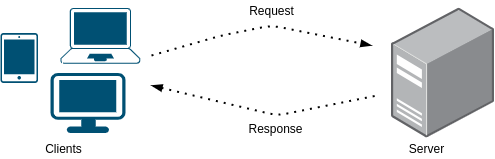
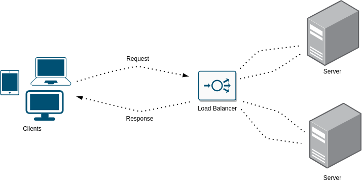
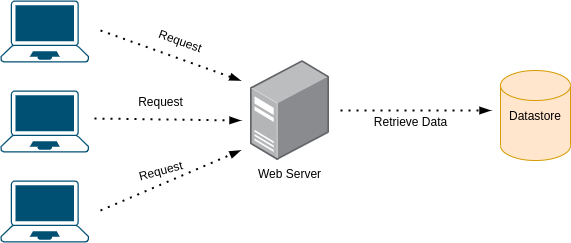
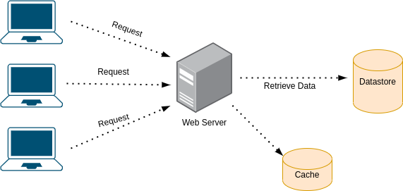
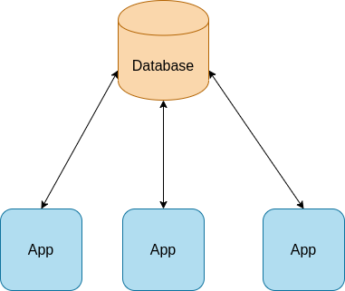
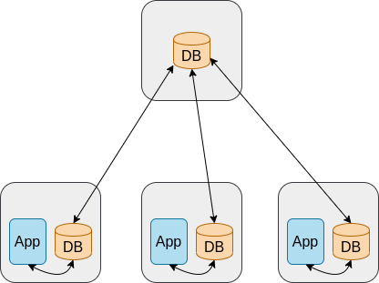

> A curated collection of resources and exercises to help you learn about system design

* [Topics](#Topics)
* [Exercises](#Exercises)
* [Questions](#Questions)
* [Resources](#Resources)
* [Q&A](common-qa.md)

## Topics

It's recommended that before you try to solve any of the exercises, to first read about the topics below, either with the [resources](#Resources) mentioned in this repo in the Resources section or your own favorite resources.

* Requirements
  * Functional
  * Non-Functional
* Scalability 
  * Vertical Scaling
  * Horizontal Scaling
* Availability
* Performance
* Resiliency
* Microservices Architecture
* Monolith Architecture
* Cache
  * Distributed Cache
  * Cache Policy (aka Replacement Policy)
    * LRU (least recently used)
* Load Balancing
  * Consistent Hashing
* Fault Tolerance
* Distributed System
* Extensibility
* Loose Coupling
* Design Level
  * Low level design
  * High level design

## Exercises

Note: not every improvement mentioned or solution is the most optimal or the only one.

### One request too many

The following is a very simple architecture of a server handling requests from a client. What are the drawbacks of this design and how to improve it?

 <b>

* Limitations:
  * Load - at some point it's possible the server will not be able to handle more requests and it will fail or cause delays
  * Single point of failure - if the server goes down, nothing will be able to handle the requests

* How to improve: 
  

  
  

* Further limitations:
    * Load was handled as well as the server being a single point of failure but now the load balancer is a single point of failure
</b>

Is there a way to improve the above design without adding an actual load balancer instance?
 <b>

Yes, one could use DNS load balancing
</b>

### Cache 101

The following is a simple architecture of a client making requests to web server which in turn, retrieves the data from a datastore. What are the drawbacks of this design and how to improve it?

 <b>

* Limitations:
  * Time - retrieving the data from the datastore every time a request is made from the client, might take a while
  * Single point of failure - if the datastore is down (or even slow) it wouldn't be possible to handle the requests
  * Load - the datastore getting all the requests can result in high load on the datastore which might result in a downtime

* How to improve: 
  

  
  

</b>

Are you able to explain what is Cache and in what cases you would use it?
 <b>

Why to use cache?

  * Save time - Accessing a remote datastore, and in general making network calls, takes time
  * Reduce load - Instead of the datastore handling all the requests, we can take some of its load and reduce by accessing the cache
  * Avoid repetitive tasks - Instead of querying the data and processing it every time, do it once and store the result in the cache
</b>

Why not storing everything in the cache?
 <b>

For multiple reasons:

1. The hardware on which we store the cache is in some cases much more expensive
2. More data in the cache, the bigger it gets and longer the put/get actions will take
</b>

### In a far far database...

The following is a system design of a remote database and three applications servers

 <b>

* Limitations:
  * Latency. Every query made to the remote database will hit latency, even if small.
  * In case the remote database crashes, the app will stop working

* How to improve: 
  

  
  

  * Replicate each database to the local app server. This has several advantages. First, we are not bound to latency anymore. Secondly, a fai

* Further limitations:
  * We are bound now to bandwidth
  * If the remote database isn't accessible for a long period of time, we'll have an outdated database and each app has the potential to work against a different DB
</b>

### In a far far database... v2

The following is an improvement of the previous system design

 <b>

* Limitations:
  * Queries to database might be slow, even on the server itself where the app is running
  * Once the remote database isn't available, the local databases will not by in sync

* How to improve: 
  
</b>

## Questions

  
Scalability

* What is Scalability?

## Resources

There many great resources out there to learn more about system design in different ways - videos, blogs, etc. I've gathered some of them here for you

### By Topic

  
Scalability

#### Videos
* [Harvard Scalability Lecture - 2012](https://www.youtube.com/watch?v=-W9F__D3oY4&ab_channel=JorgeScott)
#### Repositories
* [awesome-scalability](https://github.com/binhnguyennus/awesome-scalability) - "An updated and organized reading list for illustrating the patterns of scalable, reliable, and performant large-scale systems"

### By Resources Type

  
Videos

#### System Design
* [Gaurav Sen](https://www.youtube.com/watch?v=xpDnVSmNFX0&list=PLMCXHnjXnTnvo6alSjVkgxV-VH6EPyvoX) - Excellent series of videos on system design topics
* [System Design Interview](https://www.youtube.com/channel/UC9vLsnF6QPYuH51njmIooCQ) - How to get through system design interviews. Covering both architecture and code
#### Scalability
* [Harvard Scalability Lecture - 2012](https://www.youtube.com/watch?v=-W9F__D3oY4&ab_channel=JorgeScott)

  
Repositories

#### Scalability
* [awesome-scalability](https://github.com/binhnguyennus/awesome-scalability) - "An updated and organized reading list for illustrating the patterns of scalable, reliable, and performant large-scale systems"
#### System Design
* [system-design-primer](https://github.com/donnemartin/system-design-primer) - "Learn how to design large-scale systems. Prep for the system design interview."

## Credits

The icon in the banner made by <a href="https://www.flaticon.com/authors/freepik" title="Freepik">Freepik</a> from <a href="https://www.flaticon.com/" title="Flaticon">www.flaticon.com</a>

## Contributions

If you would like to contribute to the project, please read the [contribution guidelines](CONTRIBUTING.md)

## License

