

> A curated collection of resources and exercises to help you learn about system design

* [Topics](#Topics)
* [Topics Explained](#Topics-explained)
* [Exercises](#Exercises)
* [Questions](#Questions)
* [Resources](#Resources)
* [Designs of Real Systems](#designs-of-real-systems)
* [System Design Process](#system-design-process)
* [Interview Tips](#system-design-interview-tips)
* [Q&A](common-qa.md)

## Topics

* [Requirements](#requirements)
  * [Functional Requirements](#functional-requirements)
  * [Non-Functional Requirements](#non-functional-requirements)
* [Basic architecture](#basic-architecture)
  * [Client](#Client)
  * [Server](#Server)
  * Dispatcher
* [Scalability](#scalability)
  * [Vertical Scaling](#vertical-scaling)
  * [Horizontal Scaling](#horizontal-scaling)
  * [Scalability Factor](#scalability-factor)
    * [Linear Scalability](#linear-scalability)
    * [Sub-linear scalability](#sub-linear-scalability)
    * [supra-linear scalability](#supra-linear-scalability)
    * [Negative scalability](#negative-scalability)
* Availability
* Performance
* Resiliency
* Durability
* Microservices Architecture
* Monolith Architecture
* Cache
  * Distributed Cache
  * Cache Policy (aka Replacement Policy)
    * LRU (least recently used)
* Load Balancing
  * Consistent Hashing
  * Techniques
    * Round Robin
    * Weighted Round Robin
    * Least Connection
    * Weighted Least Connection
    * Resource Based
    * Fixed Weighting
    * Weighted Response Time
    * Source IP Hash
    * URL Hash
  * Sticky Sessions
  * Health Checks
* Fault Tolerance
* Distributed System
* Extensibility
* Loose Coupling
* Proxy
* Storage
  * RAID
* [CDN](#CDN)
* [DNS](#DNS)
* Networking
  * IP
    * [Private IP](#private-ip)
    * [Public IP](#public-ip)
  * Latency
  * Throughput
* Databases
  * Sharding
  * Read Replicas
* Design Level
  * Low level design
  * High level design

## Topics Explained

### Requirements

Usually a system design process starts with understanding the system's purpose and one way to understand system's purpose or goal, is to clearly define a list of requirements. 
These requirements allow us not only to understand how the system will be used and how it works, but also set clear boundaries which will make sure our design is focused on the right aspects of the systems. We usually distinguish between functional and non-functional requirements.

### Functional Requirements

Functional requirements are used to specify an expected function or a behaviour of the system. Simply put, something the system should be able to do. 
For example, for a video streaming service a requirement might be to upload a video or comment on a video. For instant messaging application, a functional requirement will be, to be able send and receive messages.

### Non-Functional Requirements

Non-functional requirements focus on how the system performs, especially in general and not focusing on specific functions. 
While such requirements might affect user's experience they shouldn't affect specific functionality or features the system supports.

For example, if a system is a type of a service, a non-functional requirement might be "zero downtime" or "No loss of data".

### Basic Architecture

#### Client

A client refers to a software or hardware accessing a resource or a service that is served by a server.
While in some cases the server and the client might be on the same system/host, in most cases they will be on separate systems.

Examples for clients:

* A Web browser that is used by a user to access a certain web page
* A mobile phone that is used by the user to read emails

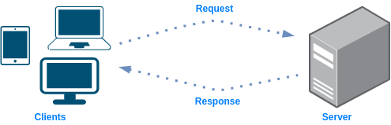

#### Server

A server, similarly to a client, can be a software or hardware, but as opposed to a client, its role is to serve the client. It can be by providing a certain resource to the client or let it use a service that is running on the server.
Few examples:

* A system that stores files and allow the user to access or download them
* A system that runs a service which allows users to listen to music

### Scalability

[Wikipedia](https://en.wikipedia.org/wiki/Scalability): "Scalability is the property of a system to handle a growing amount of work by adding resources to the system"

In simpler words, scalability is about answering the question whether a system or an architecture are able to scale in a way that meets the new workloads and demand. 
More practically, answer questions like:
  * if a system runs a database, does it able to handle more queries?
  * if a system runs a service that stream videos to million users. Will it able to stream them the same way if the amount of users would triple itself?

Also, scaling can be performed on different components. For example, in most cloud environments scaling is supported in case of:

  * Compute hosts
  * Virtual network functions
  * VMs/Instances
  * Containers

There are different ways to scale.

#### Vertical Scaling

Adding additional resources to *the existing system/component/unit*. If we have a server, a vertical scaling might be done in one or more of the following ways:

  * Adding more RAM to the server
  * Adding more storage/disks
  * Adding CPUs

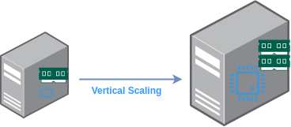

#### Horizontal Scaling

Adding more systems/units/components but at the same time, make them work together so it would seems to the client as if there is one system it interacts with. 
Few examples:

 * Instead of one web server, having two web servers with one load balancer balancing the traffic between them
 * Instead of one database server, having two databases

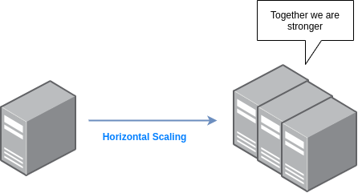

#### Scalability Factor

When you double the resources of your system (or design) you might expect your system to be able to handle double the workload as well, right? But this is not necessarily what will happen. Scalability factor is the term used to describe the workload your system is able to handle as a result of scaling your resources.

##### Linear Scalability

Linear Scalability happens when the workloads your system is able to handle scale accordingly to the scale in resources. The scalability factor remains constant as you scale. 
For example, you triple the resources of your system -> the system is able to handle triple the workloads. In reality, it's actually not the case most of the time.

##### Sub-Linear Scalability

A more realistic outcome of scaling systems would be that some resources or component may not scale as expected (or as other resources and components). So doubling the resources will actually lead to an improvement of only x1.5 in workloads handling. In this case the scalability factor will be lower than 1.0

##### Supra-Linear Scalability

This is the optimal outcome. You triple the workloads handling by "only" doubling your resources for example. In other words, the ratio in performance change is bigger than the ratio in scaling changes (e.g. adding more CPUs). A scalability factor in this case, is bigger than 1.0

##### Negative Scalability

It may sound crazy, but in some cases, scaling your system might actually lead to worse results and that's exactly what negative scalability is all about. Scalability factor is below 0.

### Networking

#### Public IP

[Wikipedia](): "A public IP address, in common parlance, is a globally routable unicast IP address, meaning that the address is not an address reserved for use in private networks"

From system design perspective, when you have a resources or a component, you would like everyone to be able to access to, whether for direct communication (like a web server) or as a gateway for other components (like a load balancer), you should use a public IP

#### Private IP

Whenever you don't want users to be  able to globally interact with a certain component or resource, you should use a private IP address. Few examples:

  * Web servers that only the load balancer should communicate with them directly
  * Internal servers that users outside the organization should access

Private IPs, as opposed to public IPs, don't have to be unique and each separate network, can use the same addresses.

#### Latency

The time it takes to perform a certain task/action

#### Throughput

The number of tasks/actions per unit of time

### DNS

[Wikipedia](https://en.wikipedia.org/wiki/Domain_Name_System): "Most prominently, it translates more readily memorized domain names to the numerical IP addresses needed for locating and identifying computer services and devices with the underlying network protocols."

In other words, the most common use can of a DNS would be a address translation. It can be from a hostname to IP address and vice versa - from an IP address to a hostname.
In addition, a DNS can be used for load balancing, using the round robin technique.

### CDN

[Cloudflare](https://www.cloudflare.com/en-gb/learning/cdn/what-is-a-cdn): "A content delivery network (CDN) refers to a geographically distributed group of servers which work together to provide fast delivery of Internet content."

In other words, a content delivery network allows you to quickly transfer content by having servers with the content around the world or certain area. The client then, access these servers instead of the main server where the data originates from.

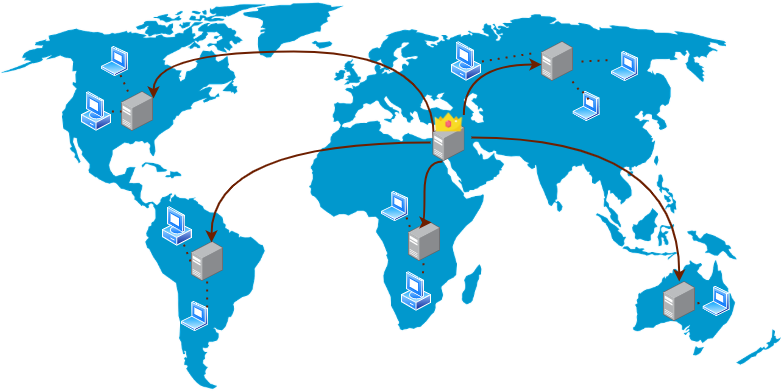

## Exercises

Note: The names of the exercises are quotes from movies (sometimes little bit modified). If you can guess from which movie, please submit it to movies.md file in this way: [QUOTE] [MOVIE] [YOUR NAME] 
Another note: Exercises may repeat themselves in different variations to practice and emphasize different concepts.

### "Elementary, my dear Watson"

You have a website running on a single server. It's mostly running fine because only two users access it on weekly basis :'( It suddenly becomes super popular and many users try to access it, but they are experiencing issues due to high load of the server. Two questions:
  * What term/pattern in system design is referring to the issue you are experiencing?
  * How can you deal with it (even if partially) WITHOUT adding more servers or changing the architecture?

 <b>

  * Scalability. Your web server doesn't scale based on demand (= the additional users accessing your website) hence they are experiencing issues.
  * Apply `vertical scaling` which means, adding more resources to your server - more CPU, more RAM. This way, your architecture doesn't change, but your website is able to serve more users.
</b>

Will 'vertical scaling' solve your scale issues permanently? Is it the optimal solution?
 <b>

It might solve your issue for limited time, but you can't solely rely on it.
Vertical scaling has limitations. You can't keep adding RAM, storage and CPU endlessly. Eventually you'll hit some physical limit where for example, you simply don't have anymore space in your server box and you bought the best components you could.
</b>

Assuming you now can extend the architecture, what would you change?
 <b>
</b>

### "Perfectly balanced, as all things should be"

You have the following simple architecture of a server handling requests from a client. What are the drawbacks of this design and how to improve it?

 <b>

* Limitations:
  * Load - at some point it's possible the server will not be able to handle more requests and it will fail or cause delays
  * Single point of failure - if the server goes down, nothing will be able to handle the requests

* How to improve: 
  

  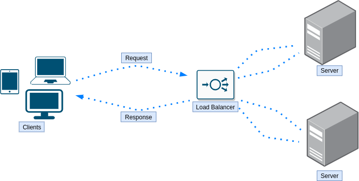
  

* Further limitations:
    * Load was handled as well as the server being a single point of failure, but now the load balancer is a single point of failure.
</b>

Is there a way to improve the above design without adding an actual load balancer instance?
 <b>

Yes, one could use DNS load balancing. 
Bonus question: which algorithm a DNS load balancer will use?
</b>

What are the drawbacks of round robin algorithm in load balancing?
 <b>

  * A simple round robin algorithm knows nothing about the load and the spec of each server it forwards the requests to. It is possible, that multiple heavy workloads requests will get to the same server while other servers will got only lightweight requests which will result in one server doing most of the work, maybe even crashing at some point because it unable to handle all the heavy workloads requests by its own.
  * Each request from the client creates a whole new session. This might be a problem for certain scenarios where you would like to perform multiple operations where the server has to know about the result of operation so basically, being sort of aware of the history it has with the client. In round robin, first request might hit server X, while second request might hit server Y and ask to continue processing the data that was processed on server X already.
</b>

### "For all my actions both public and private"

The following is an architecture of a load balancer serving and three web servers. Assuming, we would like to have a secured architecture, that makes sense, where would you set a public IP and where would you set a private IP? 

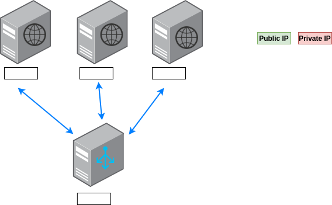

 <b>

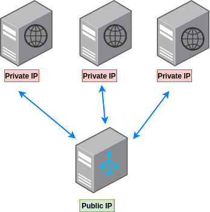

It makes sense to hide the web servers behind the load balancers instead of giving users direct access to them, so each one of them will have a private IP assigned to it.
The load balancer should have a public IP since, we except anyone who would like to access a certain web page/resource, to go through the load balancer hence, it should be accessible to users.
</b>

What load balancing techniques are there?
 <b>

  * Round Robin
  * Weighted Round Robin
  * Least Connection
  * Weighted Least Connection
  * Resource Based
  * Fixed Weighting
  * Weighted Response Time
  * Source IP Hash
  * URL Hash
</b>

### "Keep calm, all I want is your cash"

The following is a simple architecture of a client making requests to web server which in turn, retrieves the data from a datastore. What are the drawbacks of this design and how to improve it?

 <b>

* Limitations:
  * Time - retrieving the data from the datastore every time a request is made from the client, might take a while
  * Single point of failure - if the datastore is down (or even slow) it wouldn't be possible to handle the requests
  * Load - the datastore getting all the requests can result in high load on the datastore which might result in a downtime

* How to improve: 
  

  
  

</b>

Are you able to explain what is Cache and in what cases you would use it?
 <b>

Why to use cache?

  * Save time - Accessing a remote datastore, and in general making network calls, takes time
  * Reduce load - Instead of the datastore handling all the requests, we can take some of its load and reduce by accessing the cache
  * Avoid repetitive tasks - Instead of querying the data and processing it every time, do it once and store the result in the cache
</b>

Why not storing everything in the cache?
 <b>

For multiple reasons:

1. The hardware on which we store the cache is in some cases much more expensive
2. More data in the cache, the bigger it gets and longer the put/get actions will take
</b>

### "In a galaxy far, far away..."

The following is a system design of a remote database and three applications servers

 <b>

* Limitations:
  * Latency. Every query made to the remote database will hit latency, even if small.
  * In case the remote database crashes, the app will stop working

* How to improve: 
  

  
  

  * Replicate each database to the local app server. This has several advantages. First, we are not bound to latency anymore. Secondly, a fai

* Further limitations:
  * We are bound now to bandwidth
  * If the remote database isn't accessible for a long period of time, we'll have an outdated database and each app has the potential to work against a different DB
</b>

### "A bit on the slow side"

The following is an improvement of the previous system design

 <b>

* Limitations:
  * Queries to database might be slow, even on the server itself where the app is running
  * Once the remote database isn't available, the local databases will not by in sync

* How to improve: 
  
</b>

### "Always the same one"

Every request sent by the same client, is routed every time to a different web server. What problem the user might face with such design? How to fix it?

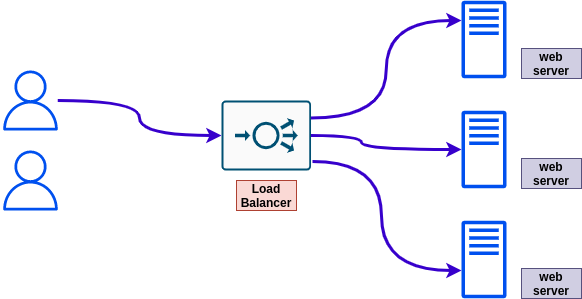

 <b>

* The problem: the user might need to authenticate every single request, because different web servers handle its requests.
* A possible solution: use sticky sessions where the user is routed to the same instance every single time

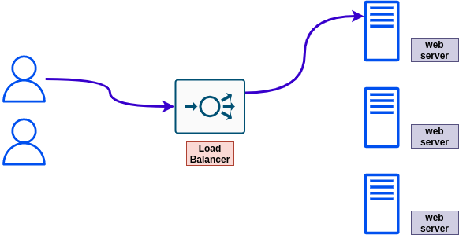
</b>

### "Coming back to find we've failed"

You have a design of load balancer and a couple of web instances behind it. Sometimes the instances crash and the user report the application doesn't works for them. Name one possible way to deal with such situation.
 <b>

One possible way to deal with it, is by using health checks. Where an instance that doesn't pass the health check, will be excluded from the list of instances used by the load balancer to forward traffic to.
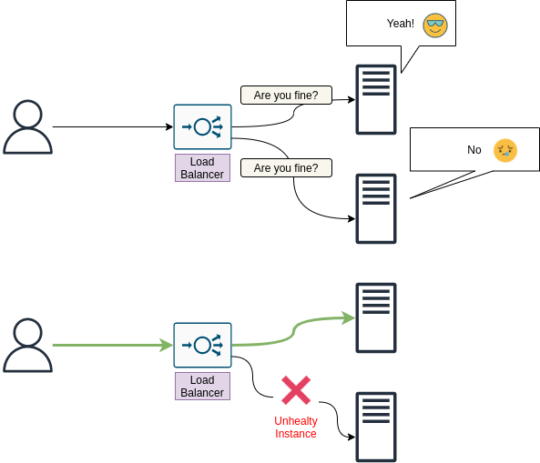
</b>

### "In any major city, minding your own business is a science"

You have a production application using a database for reads and writes. Your organization would like to add another application to work against the same database but for analytics purposes (read only). What problem might arise from this new situation and what one improvement you can apply to the design?

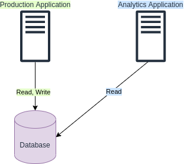

 <b>

Adding another application to work against the same database can create additional load on your database which may lead to issues since the additional load might reach the limits of your database capacity constraints.

One improvement to the design could be to add a read replica instance of your database. This way the new application can work against the read replica instead of the original database. The replication will be asynchronous but in most cases, for analytics applications, that's good enough.

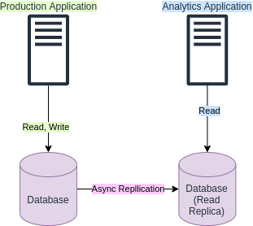
</b>

## Questions

This is a more "simplified" version of exercises section. No drawings, no evolving exercises, no strange exercises names, just straightforward questions, each in its own category.

Your website usually serves on average a dozen of users and has good CPU and RAM utilization. It suddenly becomes very popular and many users try to access your web server but they are experiencing issues, and CPU, RAM utilization seems to be on 100%. How would you describe the issue?
 <b>

Scalability issue. The web server doesn't scales :'( 
In order to avoid such issues, the web server has to scale based on the usage. More users -> More CPU, RAM utilization -> Add more resources (= scale up). An
When there are less users accessing the website, scale down.
</b>

### Scalability

Explain Scalability
 <b>
</b>

Explain "Vertical Scaling" and give an example where it can help to solve an issue
 <b>

Vertical scaling is the act of adding

For example, you have a website which serve a class of 20 students. Suddenly, you are teaching multiple classes and your website has to service 40 students. In order to be able to do that, you might have to apply "vertical scaling" and add resources like RAM and CPU to the server running your website.
</b>

Why we can't usually rely solely on "vertical scaling" to solve scaling issues?
 <b>

Because you can't keep upgrading forever a certain server. At some point, you'll hit limitations of buying the best components you could and not having additional space for more components. Maybe the best RAM you could buy is 10TB, but you actually need 19TB RAM to serve all the users.
</b>

What is "Horizontal Scaling"?
 <b>
</b>

Once we perform "Horizonal Scaling", by for example adding multiple web servers instead of having one server, how do we handle client acess to these servers? 
 <b>

Using a load balancer
</b>

### Load Balancer

Tell me everything you know about Load Balancers
 <b>
</b>

What load balancing techniques are there?
 <b>

  * Round Robin
  * Weighted Round Robin
  * Least Connection
  * Weighted Least Connection
  * Resource Based
  * Fixed Weighting
  * Weighted Response Time
  * Source IP Hash
  * URL Hash
</b>

Do you neccesrialy need a dedicated load balancer instance to perform load balancing? (using the round robin technique for example)
 <b>
No, you can use a DNS server.
</b>

What is an application load balancer?
 <b>
</b>

At what layers a load balancer can operate?
 <b>
</b>

What is DNS load balancing?
 <b>
</b>

What are the drawbacks of round robin algorithm in load balancing?
 <b>

  * A simple round robin algorithm knows nothing about the load and the spec of each server it forwards the requests to. It is possible, that multiple heavy workloads requests will get to the same server while other servers will got only lightweight requests which will result in one server doing most of the work, maybe even crashing at some point because it unable to handle all the heavy workloads requests by its own.
  * Each request from the client creates a whole new session. This might be a problem for certain scenarios where you would like to perform multiple operations where the server has to know about the result of operation so basically, being sort of aware of the history it has with the client. In round robin, first request might hit server X, while second request might hit server Y and ask to continue processing the data that was processed on server X already.
</b>

What are sticky sessions? What are their pros and cons?
 <b>
</b>

Explain each of the following load balancing techniques

  * Round Robin
  * Weighted Round Robin
  * Least Connection
  * Weighted Least Connection
  * Resource Based
  * Fixed Weighting
  * Weighted Response Time
  * Source IP Hash
  * URL Hash

 <b>
</b>

Which load balancing technique would you use for e-commerce website? Why?
 <b>

One that supports sticky sessions so users returning to the website, would have their data loaded, in case the server don't use shared storage.
</b>

### Cache

Tell me everything you know about Cache
 <b>
</b>

True or False? While caching can reduce load time, it's increasing the load on the server
 <b>

False. If your server doesn't have to execute the request since the result is already in the cache, then it's actually the opposite - there is less load on the server in addition to reduced load times.
</b>

### Networking

What is a public IP? In which scenarios, one should use a public IP?
 <b>
</b>

What is a private IP? In which scenarios, one should use a private IP?
 <b>
</b>

What is latency?
 <b>
</b>

What is latency of L1 cache reference vs. L2 cache reference?
 <b>

L1 cache reference latency is 0.5 nanosecond
L2 cache reference latency is 7 nanosecond

So basically the latency of L2 cache reference is 14x L1 cache reference.
</b>

### DNS

What is a DNS?
 <b>
</b>

Can you use DNS for load balancing?
 <b>
</b>

### Storage

What is RAID?
 <b>
</b>

### DNS

What is CDN?
 <b>
</b>

### Misc

How operating systems able to run tasks simultaneously? for example, open a web browser while starting a game
 <b>

The CPU have multiple cores. Each task is executed by a different core. 
Also, it might only appear to run simultaneously. If every process is getting CPU allocation every nanosecond, the user might think that both processes are running simultaneously.
</b>

What is a VPS?
 <b>

[From wikipedia](https://en.wikipedia.org/wiki/Virtual_private_server): "A virtual private server (VPS) is a virtual machine sold as a service by an Internet hosting service."
</b>

True or False? VPS is basically a shared server where each user is allocated with a portion of the server OS
 <b>

False. You get a private VM that no one else can or should use.
</b>

## Resources

There many great resources out there to learn about system design in different ways - videos, blogs, etc. I've gathered some of them here for you

### By Topic

  
System Design Introduction

#### Articles
* [Introduction To Systems Design - 2020](https://medium.com/swlh/introduction-to-systems-design-9bdab73fb8)

  
Scalability

#### Videos
* [Harvard Scalability Lecture - 2012](https://www.youtube.com/watch?v=-W9F__D3oY4&ab_channel=JorgeScott)
#### Repositories
* [awesome-scalability](https://github.com/binhnguyennus/awesome-scalability) - "An updated and organized reading list for illustrating the patterns of scalable, reliable, and performant large-scale systems"

### By Resources Type

  
Videos

#### System Design
* [Gaurav Sen](https://www.youtube.com/watch?v=xpDnVSmNFX0&list=PLMCXHnjXnTnvo6alSjVkgxV-VH6EPyvoX) - Excellent series of videos on system design topics
* [System Design Interview](https://www.youtube.com/channel/UC9vLsnF6QPYuH51njmIooCQ) - How to get through system design interviews. Covering both architecture and code
#### Scalability
* [Harvard Scalability Lecture - 2012](https://www.youtube.com/watch?v=-W9F__D3oY4&ab_channel=JorgeScott)

  
Repositories

#### Scalability
* [awesome-scalability](https://github.com/binhnguyennus/awesome-scalability) - "An updated and organized reading list for illustrating the patterns of scalable, reliable, and performant large-scale systems"
#### System Design
* [system-design-primer](https://github.com/donnemartin/system-design-primer) - "Learn how to design large-scale systems. Prep for the system design interview."

  
Books

  
Articles

#### Introduction
* [Introduction To Systems Design - 2020](https://medium.com/swlh/introduction-to-systems-design-9bdab73fb8)

## Designs of Real Systems

This section covers system designs of real world applications.

Each section here will include full details on the system. It's recommended, as part of your learning process, that you will NOT look at these full details and start by trying figuring them out by yourself. More specifically, for every system:

  * Create a list of its functional requirements, features
  * Create a list of its non functional requirements
  * Design API spec
  * Perform high-level design
  * Perform detailed design

### WhatsApp

#### WhatsApp - Features / Functional Requirements

  * Messaging with individuals and groups (send and receive)
  * Sharing documents, images, videos
  * User status - online, last seen, etc.
  * Message status - delivered, read (and who read it)
  * Encryption - encrypt end-to-end communication

#### WhatsApp - Non Functional Requirements

  * Scale
  * Minimal Latency
  * High Availability
  * Consistency
  * Durability

#### WhatsApp - API Spec

Messaging:

  * Direct Chat Session
    * Input: API key, user ID, user ID (recipient)
  * Send Message
    * Input: API key, session ID, message type, message

User account:

  * Register account
    * Input: API key, user data
  * Validate account
    * Input: API key, user ID, validation code

#### WhatsApp - System Design Overview

#### Whatsapp - System Design Components

## System Design Process

How to perform system design?
TODO(abregman): this section is not yet ready

1. Define which quality attributes are important for your system - scalability, efficiency, reliability, etc.

## System Design Interview Tips

If you are here because you have a system design interview, here are a couple of suggestions

### What to ask yourself when you see a design and asked to give an opinion on it

Note: You might want to ask yourself these questions also after you've done performing a system design

* Does it scale if I add more users?
* Is there a single point of failure in the design?
* Don't be shy about asking for clarifications on a given system design. Some system design are vague on purpose

### What you might want to ask when you need to perform a system design

* What are the requirements?
  * How the system is used?
  * How much users are expected to access the system?
  * How often the users access the system?
  * Where the users access the system from?
* Are there any constraints?
* Ask for clarifications if needed. Sometimes instructions or requirements are vague on purpose.

#### What to say at the beginning of the discussion on a system design

* List the required features of the system
* State problem you expect to encounter
* State the traffic you expect the system to handle

### What you might want to state during the design or the discussion

* At each decision made about the system design, state what are the cons and pros of such decision

## Credits

The icon in the banner made by <a href="https://www.flaticon.com/authors/freepik" title="Freepik">Freepik</a> from <a href="https://www.flaticon.com/" title="Flaticon">www.flaticon.com</a>

## Contributions

If you would like to contribute to the project, please read the [contribution guidelines](CONTRIBUTING.md)

## License

