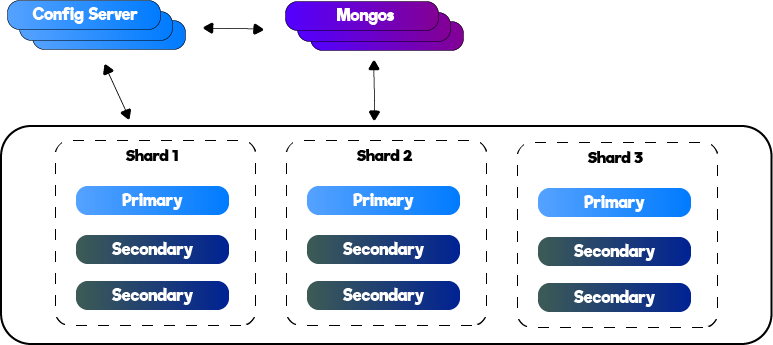
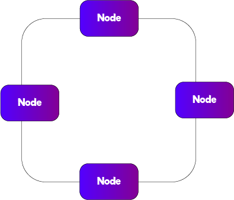
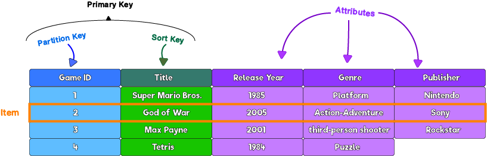
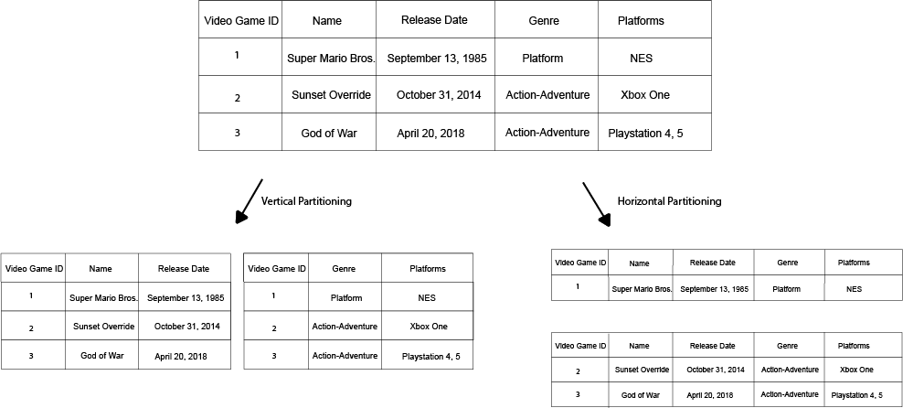
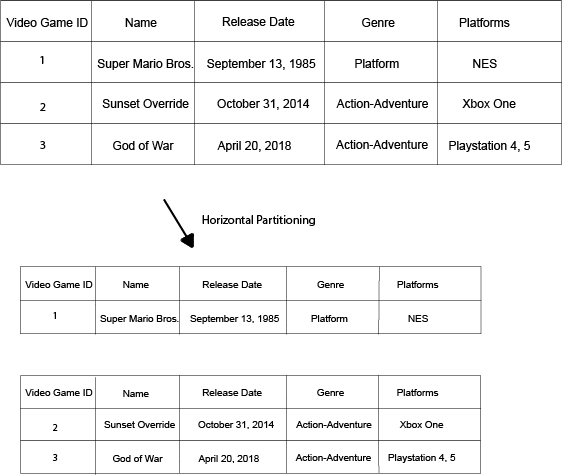
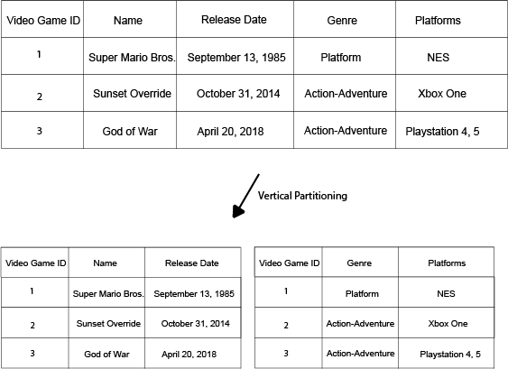
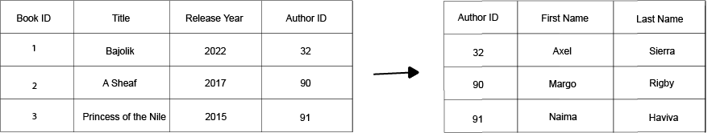
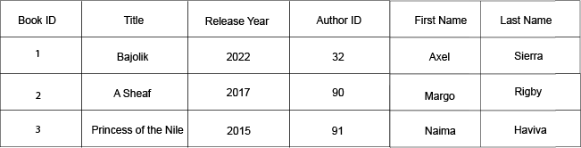

# Databases

- [Databases](#databases)
  - [What is a Database?](#what-is-a-database)
  - [Types](#types)
    - [SQL](#sql)
    - [NoSQL](#nosql)
      - [MongoDB](#mongodb)
      - [Cassandra](#cassandra)
      - [AWS DynamoDB](#aws-dynamodb)
      - [Redis](#redis)
  - [Big Data](#big-data)
    - [Data Lake](#data-lake)
  - [Replication](#replication)
  - [Partitioning](#partitioning)
    - [Horizontal Partitioning](#horizontal-partitioning)
    - [Vertical Partitioning](#vertical-partitioning)
  - [ACID Compliance](#acid-compliance)
    - [Atomicity](#atomicity)
    - [Consistency](#consistency)
    - [Isolation](#isolation)
    - [Durability](#durability)
  - [Normalization](#normalization)
    - [Normalized Data](#normalized-data)
    - [Denormalized Data](#denormalized-data)
    - [CAP Theorem](#cap-theorem)
  - [Questions](#questions)

## What is a Database?

[Wikipedia](https://en.wikipedia.org/wiki/Database): "a database is an organized collection of data stored and accessed electronically from a computer system."

Perhaps the most basic example for a database would be a file on filesystem. This file can store information on people and their addresses, it can contain information on types of wine, or any other organized data.

Even though a file can be considered a database, you'll not find it used in system designs. Databases today are full and rich services that supports much more than just storing your data.

## Types

### SQL

### NoSQL

NoSQL don't use the traditional tabular relationship as in SQL databases. They are also known as "Sharded Databases" as information is [horizontally partitioned](#horizontal-partitioning).

Some of the challenges with such databases is the operation of resharding - how to add or remove shards based on the scaling that has to take place?
Another challenge is what is known as "hotspots" - how to deal with shards/partitions that are more popular than other shards? In other words, how to take into account traffic/popularity when performing partitioning?

Let's look at some examples of such databases

#### MongoDB

#### Cassandra

NoSQL database. Its architecture can be can seen in the drawing below. Each node can act as a primary interface so availability is high in Cassandra architecture

While availability might be better in Cassandra compared to other databases, as each node can be the primary interface, it requires constantly synching them so consistency isn't at its top.

#### AWS DynamoDB

TODO

#### Redis

Redis is an in-memory database. It's considered to very fast database for this reason. The data in Redis is stored in key-value pairs.

It's ideal for use cases where you need to read/write often from the DB, especially in real-time systems where you don't want to be limited by I/O of disks which considered to be slower (~100us for SSD vs ~100ns in case of RAM).

Redis is also single threaded. You might wonder how does it work as such database can hit multiple incoming requests and outgoing responses, so how is the thread not blocked, waiting for completion? The answer is I/O multiplexing - the OS allows a single thread to wain on many connections simultaneously.

## Big Data

### Data Lake

Data Lake is an approach in which te data is simply organized in text files (json, csv, etc.) and is stored in a storage system (e.g. S3, Blob Storage, etc.)

The data in data lakes is often unstructured data and there is usually another process/service for creating schema for that data (in AWS for example that would be Amazon Glue)

## Replication

[Wikipedia](https://en.wikipedia.org/wiki/Replication_(computing)): "Replication in computing involves sharing information so as to ensure consistency between redundant resources, such as software or hardware components, to improve reliability, fault-tolerance, or accessibility."

You'll see in many system designs that it's quite common to have separate instance for writes and another instance for reads. Thing is, when you split it into read and write instances, you have to make sure the data is consistent. This is where replication becomes relevant.

## Partitioning

The ways you divide DB tables into additional tables

### Horizontal Partitioning

Dividing a table into multiple tables. While it's physically split, logically it's treated as one table.

As an example, let's take a database for video games. We might have a separate database for each video game genre or each video game developer company, but eventually all treated as "video games" database so each table has the same columns.

To summarize:
* Divide table into multiple tables with different rows
* Each table has the same columns but different rows
* Horizontal partition is also known as Shard.

### Vertical Partitioning

Similarly to Horizontal Partitioning, we divide the table into tables. The difference is that in Vertical Partitioning each table has less columns (while in Horizontal Partitioning it's the same number of columns in each separate table)

To summarize:
* Divide table into multiple tables with different columns
* Each table doesn't have the same columns

## ACID Compliance

ACID Compliance is a set of database properties/principles guarantee data consistency and validity.

### Atomicity 

The rule of atomicity defines that either the entire transaction succeeds or it entirely fails.
For example if you add data, either you added it completely or you didn't add it at all, there is adding the data partially. In other words, it done once completely or it doesn't happen at all.

### Consistency 

Consistency mean that whatever is written to the database would be returned if a moment after writing it, you perform a read operation.

### Isolation

One transaction won't interfere another transaction and the other transcation won't be affected by it in any case.

### Durability

Once a transcation is complete, the data stays in the database no matter what happens next (except delete operation of course). So if for example the database is getting showdown, rebooted, upgraded, ... the data remains as it is.

## Normalization
### Normalized Data

Data broken into multiple tables and in order to get the full data, you'd have to perform joins on different tables.

This is the way rational databases work - there are relations between different tables and you perform lookups and joins to get full data set.

The image below is an example of normalized data

Advantages:

* Updates performed in one place since there is dedicated table for each data.

Disadvantages:

* To get data, you have to perform sometimes multiple lookups

### Denormalized Data

All the information is stored in one place as can be seen in the image below

Advantages:

* Single lookup/query to get all the information regarding specific entry

Disadvantages:

* To update information, a scan of all the entries/rows will have to be performed 

### CAP Theorem

According to CAP Theorem (aka Brewer's theorem) any distributed DB can only achieve two out of the following three at any given point of time:

* Consistency: For any read request, the most recent write is returned
* Availability: The DB is highly available so any request gets a response
* Partition Tolerance: In case of a network issue, the system will continue to operate? Can the database scale horizontally?

CAP Theorem overtime became quite weak as most modern databases actually deal with all these aspects quite good.
## Questions

What are the advantages of replicating a database?
 <b>

* Introducing high-availability: when creating a replication, you actually create another source of data you can use, even when your original instance is down
* Performances are better spread: you can decide that one of the instances is for reads while the other one is for reads
* Your app becomes more reliable: even if your database is down, the replication can still be used
</b>

Explain Horizontal Partitioning
 <b>

Read [here](#horizontal-partitioning)
</b>

Explain Vertical Partitioning
 <b>

Read [here](#vertical-partitioning)
</b>

What's a Shard?
 <b>

Another name for [horizontal partitioning](#horizontal-partitioning) where a single table becomes multiple smaller tables.
</b>

Describe the architecture of one common database
 <b>

There are a couple mentioned in this page:

* [MongoDB](#mongodb)
* [Cassandra](#cassandra)
</b>

What is Resharding?
 <b>
</b>

What is denormalized data? Explain the advantages and disadvantages of denormalized data
 <b>
</b>

What is normalized data? Explain the advantages and disadvantages of normalized data
 <b>
</b>

When would you choose normalized data approach over denormalized data approach?
 <b>

There is not always a clear answer on that. That very much depends on user or customer experience and the queries that will be executed on the database.

For example, if you need to perform updates quite often and of different columns or sub-documents, then a normalizied data might be a better approach.

If it's mainly about performing lookups then in that case a denormalized data might work better. But again, it all depends on the specific scenario.
</b>

What is a data lake?
 <b>
</b>

What can you say on in-memory database vs. disk-based database in regards to code implementation?
 <b>

Memory-based database are usually easier to implement or at least less complicated as you have to handle quite a lot of operations when writing/reading from a disk (opening a file, buffer allocation, closing a file, etc.)
</b>

When you see data in database, how do you know it was added there completely and not partially. In other words, how do you know that a write transaction to the database was completed successfully?
 <b>

Due to atomicity in [ACID Compliance](#acid-compliance).
</b>

Explain the CAP Theorem
 <b>
</b>

How do you choose a database?
 <b>

Asking the following questions might help to narrow the choice:

* Type of data you need to store (text, images, ...)
* What is important for you? for example: consistency, availability, ... in general, trying to apply the CAP Theorem might be a good idea
* Access patterns: do you mostly read data? write data? consistent traffic? unpredictable traffic with spikes?
</b>

Apply the CAP Theorem on some of the modern databases
 <b>

* Cassandra: There is availability (there are multiple nodes) and there is partition-tolerance, but there is no consistency as there is no a single master in Cassandra and data has to by synched between all the nodes so you always get the same read, doesn't matter which node you approach

* MongoDB: It's partition-tolerance as it scales horizontally and there are multiple shards. It's also consistent as it's single master. But since it's a single master architecture, there is no availability. There is a single point of failure (yes, even if you have more servers and backups as you'll need to restore and sync the data at a moment of failure).
</b>
