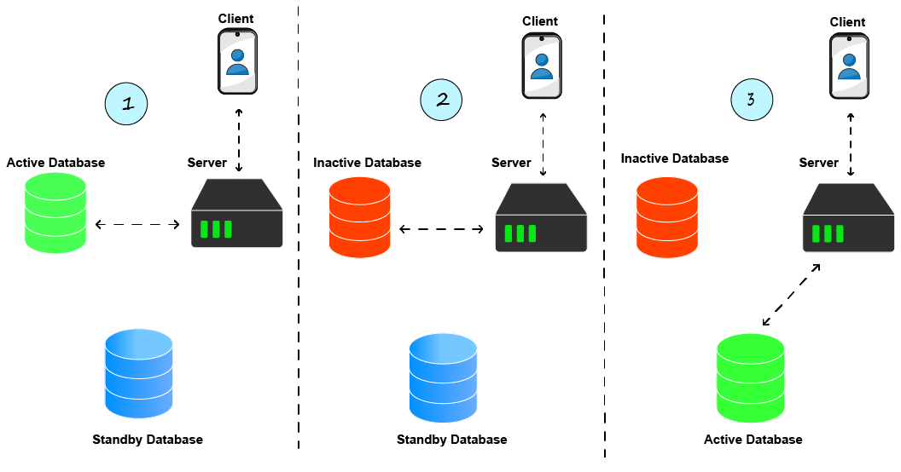
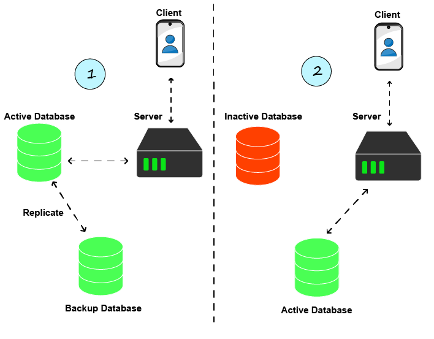

- [Reliability](#reliability)
- [Serviceability](#serviceability)
- [Availability](#availability)
- [Failover](#failover)
    - [Cold Standby](#cold-standby)
      - [Advantages](#advantages)
      - [Disadvantges](#disadvantges)
    - [Use Cases](#use-cases)
    - [Warm Standby](#warm-standby)
      - [Advantages](#advantages-1)
      - [Disadvantages](#disadvantages)
- [Questions](#questions)
  - [Failover](#failover-1)
# Reliability

[Wikipedia](https://en.wikipedia.org/wiki/Reliability,_availability_and_serviceability): "Reliability can be defined as the probability that a system will produce correct outputs up to some given time t.[5] Reliability is enhanced by features that help to avoid, detect and repair hardware faults. A reliable system does not silently continue and deliver results that include uncorrected corrupted data."

Question: can you explain the difference between Availability and Reliability?

# Serviceability

[Wikipedia](https://en.wikipedia.org/wiki/Reliability,_availability_and_serviceability): "Serviceability or maintainability is the simplicity and speed with which a system can be repaired or maintained; if the time to repair a failed system increases, then availability will decrease."

# Availability

[Wikipedia](https://en.wikipedia.org/wiki/Reliability,_availability_and_serviceability): "Availability means the probability that a system is operational at a given time, i.e. the amount of time a device is actually operating as the percentage of total time it should be operating. High-availability systems may report availability in terms of minutes or hours of downtime per year."

In simpler words, the percentage of time a system, service or app is accessible, operational

# Failover

Failover (or failover strategy) is the process of switching upon a failure from non-operational system (application, storage, DB, ...) to an operational system or a previous operational state of the same system.

It used to be done either automatically or manually. Today, especially in the era of public clouds, this process is often automated.

### Cold Standby

In Cold Standby the transition to the backup/standby service happens only after the active service becomes non-operational. The process is described in the image below taking as example a database:

1. The server works against an active database
2. The database becomes non-operational for different reasons
3. There is a switch to the standby database. It's important to note that this switch might not be quick. It might involve a process of restoring the data and it will for sure involve redirecting the traffic to the new database instead of the previous one

#### Advantages

* Cheap when compared to other failover options today
There is not much more than that. Some will argue it's also simple, but personally I would say it's based on the case.
#### Disadvantges

* There is a downtime. Users will experience non-operational service it as there is no active database until the switch the to standby database happens. This can be quick but at the same time it can take time, depends on the amount of data in the case of databases.
* Any traffic happened during the downtime and any data the user wanted to save to the DB, is lost.

### Use Cases

* Non-critical services and projects that can stand a downtime of a couple of hours and look for a cheap failover solution

### Warm Standby

In Cold Standby we described a situation where the standby database used only once there is a failure and there might be an operation of restoring the data first. Warm Standby is different in that way where the standby database is continuously being synced by production/operational database.

The server itself isn't communicating with the standby database but the it is active because data is replicated there by the production/operational database.

#### Advantages

* Simple mostly. In the case of databases, most modern databases have the ability to replicate themselves with a simple configuration change

#### Disadvantages

* There is a downtime. It's not as nearly as bad as in the case of Cold Standby, but data might still be lost and users will have bad experience, even if short time

# Questions
## Failover

Explain what is a "Failover". What does it happen?
 <b>
</b>

Explain "Cold Standby" failover strategy (including pros and cons)
 <b>
</b>

In what situations would you use "Cold Standby"?
 <b>
</b>

Explain "Warm Standby" failover strategy (including pros and cons)
 <b>
</b>

Explain "Hot Standby" failover strategy (including pros and cons)
 <b>
</b>
